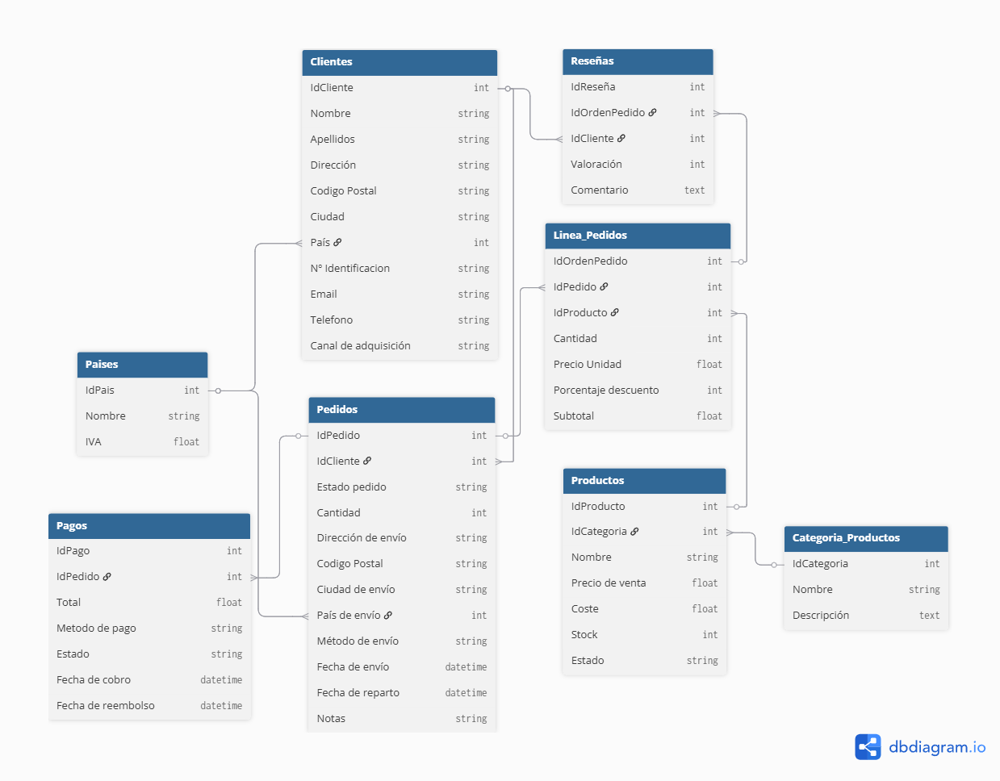

## Índice
1. [Visión General](#visión-general)
2. [Modelo de Datos](#modelo-de-datos)
3. [Análisis de Normalización 3NF](#análisis-de-normalización-3nf)
4. [Decisiones de Diseño](#decisiones-de-diseño)
5. [Relaciones y Restricciones](#relaciones-y-restricciones)

---

## Visión General

La base de datos **Temuzon** es un sistema de gestión de e-commerce diseñado para administrar:
- Catálogo de productos organizados por categorías
- Gestión de clientes e información de contacto
- Procesamiento de pedidos y líneas de pedido
- Sistema de pagos y seguimiento de transacciones
- Reseñas y evaluaciones de productos
- Información geográfica de países con cálculo de IVA

El diseño sigue principios de **normalización relacional de tercera forma normal (3NF)** para garantizar:
- Integridad referencial
- Eliminación de redundancia de datos
- Facilidad de mantenimiento y actualización

---

## Modelo de Datos

### Tablas del sistema

<strong>1. `Paises`</strong>

Tabla maestra que centraliza la información fiscal y geográfica de cada país.

| Campo | Tipo | Descripción |
|---|---:|---|
| `IdPais` | INT | Identificador único de país, clave primaria |
| `Nombre` | STRING | Nombre del país |
| `IVA` | INT | Porcentaje de impuesto aplicado en ese país |

**Observación de diseño**
- Se eliminó el campo `Continente` porque no aporta valor funcional directo al modelo transaccional.
- Esta tabla se utiliza como referencia fiscal tanto para clientes como para pedidos.

<strong>2. `Categoria_Productos`</strong>

Clasifica el catálogo de productos.

| Campo | Tipo | Descripción |
|---|---:|---|
| `IdCategoria` | INT | Identificador único de categoría, clave primaria |
| `Nombre` | STRING | Nombre visible de la categoría |
| `Descripción` | TEXT | Descripción ampliada |

**Observación de diseño**
- La categoría queda separada de producto para evitar duplicación de información.
- La descripción larga se mantiene en `TEXT` porque no requiere operaciones aritméticas ni búsquedas exactas frecuentes.

<strong>3. `Productos`</strong>

Representa el inventario vendible.

| Campo | Tipo | Relación | Descripción |
|---|---:|---|---|
| `IdProducto` | INT | PK | Identificador del producto |
| `IdCategoria` | INT | FK → `Categoria_Productos.IdCategoria` | Categoría asociada |
| `Nombre` | STRING |  | Nombre del producto |
| `Precio de venta` | FLOAT |  | Precio de venta actual |
| `Coste` | FLOAT |  | Coste interno o de adquisición |
| `Stock` | INT |  | Unidades disponibles |
| `Estado` | STRING |  | Estado funcional del producto |

**Observación de diseño**
- Los importes pasan a `FLOAT` en el esquema actual, lo que permite decimales.
- Si el modelo se usara para facturación estricta, `DECIMAL` sería una opción más robusta, pero aquí se documenta el esquema real exportado.

<strong>4. `Clientes`</strong>

Contiene la información de los clientes del sistema.

| Campo | Tipo | Relación | Descripción |
|---|---:|---|---|
| `IdCliente` | INT | PK | Identificador único del cliente |
| `Nombre` | STRING |  | Nombre |
| `Apellidos` | STRING |  | Apellidos |
| `Dirección` | STRING |  | Dirección postal |
| `Codigo Postal` | INT |  | Código postal |
| `Ciudad` | STRING |  | Ciudad |
| `País` | STRING | FK → `Paises.IdPais` | País de residencia |
| `Nº Identificacion` | STRING |  | Documento de identidad |
| `Email` | STRING |  | Correo electrónico |
| `Telefono` | STRING |  | Teléfono |
| `Canal de adquisición` | STRING |  | Origen de captación del cliente |

**Observación de diseño**
- El campo `País` se documenta como `STRING` porque así aparece en la exportación, pero lógicamente actúa como una FK a `Paises.IdPais`.
- En una versión final convendría alinear el tipo físico con la PK referenciada para evitar inconsistencias de implementación.
- `Nº Identificacion` permanece como texto porque puede incluir formatos heterogéneos.

<strong>5. `Pedidos`</strong>

Registra las órdenes de compra.

| Campo | Tipo | Relación | Descripción |
|---|---:|---|---|
| `IdPedido` | INT | PK | Identificador del pedido |
| `IdCliente` | STRING | FK → `Clientes.IdCliente` | Cliente que realiza la compra |
| `Estado pedido` | STRING |  | Estado del pedido |
| `Cantidad` | INT |  | Cantidad total de artículos |
| `Dirección de envío` | STRING |  | Dirección de entrega |
| `Codigo Postal` | INT |  | Código postal de envío |
| `Ciudad de envío` | STRING |  | Ciudad de entrega |
| `País de envío` | INT | FK → `Paises.IdPais` | País destino |
| `Método de envío` | STRING |  | Método logístico |
| `Fecha de envío` | DATETIME |  | Fecha real de envío |
| `Fecha de reparto` | DATETIME |  | Fecha de entrega |
| `Notas` | STRING |  | Observaciones adicionales |

**Observación de diseño**
- El sistema conserva la dirección de envío como parte del pedido para mantener el histórico exacto del momento de la compra.
- El país de envío se separa del país del cliente porque un cliente puede residir en un país y recibir el pedido en otro.
- El campo `IdCliente` aparece como `STRING` en la exportación; a nivel lógico debería ser compatible con `Clientes.IdCliente`.

<strong>6. `Linea_Pedidos`</strong>

Detalle de cada producto incluido en un pedido.

| Campo | Tipo | Relación | Descripción |
|---|---:|---|---|
| `IdOrdenPedido` | INT | PK | Identificador de la línea |
| `IdPedido` | INT | FK → `Pedidos.IdPedido` | Pedido al que pertenece |
| `IDProducto` | INT | FK → `Productos.IdProducto` | Producto vendido |
| `Cantidad` | INT |  | Unidades vendidas |
| `Precio Unidad` | FLOAT |  | Precio unitario en el momento de la venta |
| `Porcentaje descuento` | FLOAT |  | Descuento aplicado |
| `Subtotal` | INT |  | Total calculado de la línea |

**Observación de diseño**
- La tabla separa la relación N:M entre pedidos y productos.
- `Precio Unidad` y `Porcentaje descuento` usan `FLOAT` para conservar decimales.
- `Subtotal` se almacena para facilitar consultas y reportes sin recalcular constantemente.
- La decisión de guardar el precio en la línea preserva el valor histórico aunque el precio del producto cambie después.

<strong>7. `Pagos`</strong>

Gestiona las transacciones de cobro y reembolso.

| Campo | Tipo | Relación | Descripción |
|---|---:|---|---|
| `IdPago` | INT | PK | Identificador del pago |
| `IdPedido` | INT | FK → `Pedidos.IdPedido` | Pedido asociado |
| `Cantidad` | INT |  | Importe pagado |
| `Metodo de pago` | STRING |  | Medio de pago |
| `Estado` | STRING |  | Estado de la transacción |
| `Fecha de cobro` | DATETIME |  | Fecha de cobro |
| `Fecha de reembolso` | DATETIME |  | Fecha de devolución |

**Observación de diseño**
- La entidad de pagos queda separada del pedido para soportar estados de cobro y reembolso con trazabilidad.
- El campo `Cantidad` representa el importe transaccionado.

<strong>8. `Reseñas`</strong>

Sistema de opinión de los clientes.

| Campo | Tipo | Relación | Descripción |
|---|---:|---|---|
| `IdReseña` | INT | PK | Identificador de la reseña |
| `IdOrdenPedido` | INT | FK → `Linea_Pedidos.IdOrdenPedido` | Línea de pedido reseñada |
| `IdCliente` | INT | FK → `Clientes.IdCliente` | Cliente autor de la reseña |
| `Valoración` | INT |  | Puntuación |
| `Comentario` | TEXT |  | Texto libre |

**Observación de diseño**
- La reseña se vincula a una línea de pedido concreta, no directamente al producto, para asegurar que se reseñen compras reales.
- Esto refuerza la trazabilidad entre compra y opinión.

---

## Análisis de Normalización 3NF

### 1NF
La primera forma normal exige que cada atributo sea atómico.

**Cumplimiento**
- Cada campo almacena un único valor lógico.
- No hay listas, conjuntos ni grupos repetidos dentro de una misma columna.
- La separación entre `Pedidos` y `Linea_Pedidos` evita repetir productos dentro del pedido en un solo registro.

### 2NF
La segunda forma normal exige que todo atributo no clave dependa de la clave completa.

**Cumplimiento**
- `Productos`: los atributos dependen de `IdProducto`.
- `Clientes`: los atributos dependen de `IdCliente`.
- `Pedidos`: los atributos dependen de `IdPedido`.
- `Linea_Pedidos`: cada dato depende de la línea, no de un atributo parcial de una clave compuesta.

### 3NF
La tercera forma normal exige que no existan dependencias transitivas entre atributos no clave.

**Cumplimiento general**
- `Paises` depende solo de `IdPais`.
- `Categoria_Productos` depende solo de `IdCategoria`.
- `Productos` depende solo de `IdProducto`.
- `Pagos` depende solo de `IdPago`.
- `Reseñas` depende solo de `IdReseña`.

**Puntos a vigilar**
- `Clientes` conserva dirección, ciudad, código postal y país en la misma entidad porque, para este proyecto, la dirección se trata como un bloque operativo y no como un catálogo de direcciones independiente.
- `Pedidos` guarda la dirección de envío completa por motivos de histórico y auditoría.
- `Linea_Pedidos` duplica el precio unitario por motivo histórico, aunque eso implique una desnormalización controlada.

### Excepciones justificadas

#### `Clientes.País`
- Está relacionado con `Paises`, porque el país es un dato fiscal y no una simple etiqueta textual.
- En la exportación aparece como `STRING`, pero el modelo lógico lo trata como referencia a `IdPais`.
- Conviene alinear el tipo físico con la FK si se implementa una versión final del esquema.

#### `Pedidos.Dirección de envío`
- Se almacena para conservar el estado exacto del pedido en el momento de compra.
- Si el cliente cambia su dirección después, el histórico del pedido no se pierde.

#### `Linea_Pedidos.Precio Unidad`
- Se almacena para congelar el precio aplicado en la venta.
- Si el precio del producto cambia más adelante, no se alteran las líneas antiguas.
- El uso de `FLOAT` favorece la representación de decimales, aunque para finanzas puras sería mejor `DECIMAL`.

---

## Decisiones de Diseño

### Tipos numéricos
- Los precios y descuentos se han documentado como `FLOAT` porque así aparece el esquema modificado.
- Para importes contables críticos, `DECIMAL` sería más seguro, pero el documento debe reflejar el modelo actual.
- `Stock` y cantidades se mantienen como `INT` porque representan unidades completas.

### Identificadores y relaciones
- Los identificadores se centralizan en tablas maestras como `Paises` y `Categoria_Productos`.
- `Linea_Pedidos` actúa como tabla de detalle y resuelve la relación N:M entre pedidos y productos.
- `Pedidos` se desacopla de la dirección de residencia del cliente porque un pedido puede enviarse a otro destino.

### Auditoría y trazabilidad
- `Linea_Pedidos` conserva el precio histórico de la compra.
- `Pagos` separa cobro y reembolso para tener trazabilidad completa.
- `Reseñas` se ancla a una línea comprada para evitar opiniones de productos no adquiridos.

---

## Relaciones y Restricciones

### Relaciones principales
- `Categoria_Productos.IdCategoria` → `Productos.IdCategoria`
- `Paises.IdPais` → `Clientes.País`
- `Paises.IdPais` → `Pedidos.País de envío`
- `Clientes.IdCliente` → `Pedidos.IdCliente`
- `Pedidos.IdPedido` → `Linea_Pedidos.IdPedido`
- `Productos.IdProducto` → `Linea_Pedidos.IDProducto`
- `Pedidos.IdPedido` → `Pagos.IdPedido`
- `Clientes.IdCliente` → `Reseñas.IdCliente`
- `Linea_Pedidos.IdOrdenPedido` → `Reseñas.IdOrdenPedido`

### Reglas de integridad
1. No puede existir un pedido sin cliente.
2. No puede existir una línea de pedido sin pedido ni producto.
3. No puede existir un pago sin pedido.
4. No puede existir una reseña sin cliente y sin línea de compra real.
5. No deben existir países referenciados por clientes o pedidos si todavía hay registros dependientes.

